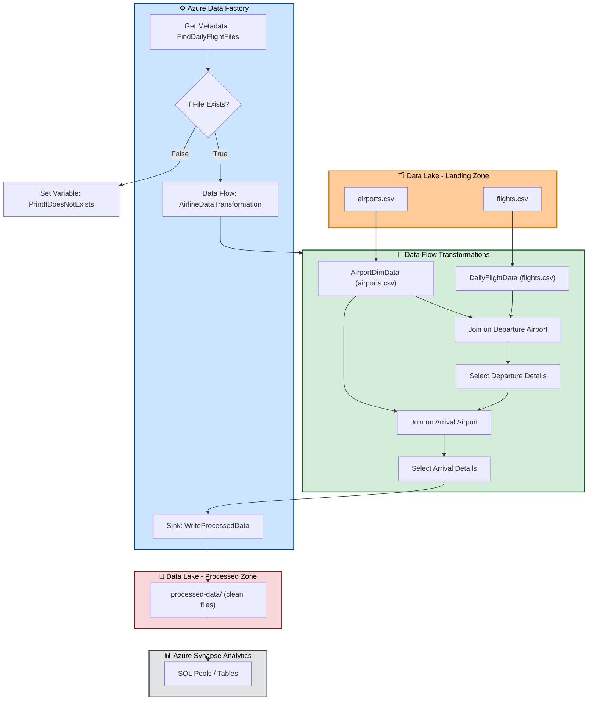

# ✈️ Airlines Data Incremental Processing with CI/CD

## 📌 Project Overview

This project demonstrates an **end-to-end data engineering pipeline** for processing airline flight data using **Azure Data Factory (ADF)**, **Azure Synapse Analytics**, and **Azure Data Lake Storage (ADLS)**.
It implements a **Dev → Prod CI/CD workflow** using **Azure DevOps Pipelines** and **GitHub**, ensuring automated deployment of incremental updates with **ARM templates**.

The use case:

* **Raw flight & airport data** is ingested into **ADLS (Landing Zone)**.
* Data is **transformed and enriched** in **ADF Data Flows**.
* Cleaned and processed data is stored in the **Processed Zone (ADLS)** and made available in **Azure Synapse Analytics** for downstream analytics and reporting.

---

## 🚀 Tech Stack

* **Azure Data Lake Storage (ADLS)** – Raw & Processed data storage
* **Azure Data Factory (ADF)** – Orchestration & Data Flow transformation
* **Azure Synapse Analytics** – Data warehouse for reporting & BI
* **Azure Logic Apps** – Event-driven automation
* **Azure DevOps** – CI/CD pipelines & Release management
* **GitHub** – Version control & collaboration

---

## ⚙️ Architecture & Workflow


---

## 🛠️ Implementation Steps

### **1. Azure DevOps Setup**

* Created **Organization, Project, Repo, and Agent Pool**
* Configured **local agent** for CI/CD execution

### **2. Development Environment (Dev ADF - rohe-airline-adf-dev)**

* **Linked Service**: `AzureDataLakeStorage1` → container `airlinedev`

* **Datasets**:

  * `AirlineDimSource` → `landing-zn/airports.csv`
  * `DailyFlightsSource` → `landing-zn/flights.csv`
  * `ProcessedData` → `processed-data/`

* **Data Flow: AirlineDataTransformation**

  * `AirportDimData` → source from `AirlineDimSource`
  * `DailyFlightData` → source from `DailyFlightsSource`
  * **Join 1**: Departure (OriginAirportID = airport\_id)
  * **Select**: Departure airport attributes
  * **Join 2**: Arrival (DestAirportID = airport\_id)
  * **Select**: Enriched flight data
  * **Sink**: `ProcessedData` dataset

* **Pipeline: airlinepipeline**

  * **Get Metadata** → `FindDailyFlightFiles`
  * **If Condition** → check file existence

    * `False`: Set Variable → `PrintIfDoesNotExists`
    * `True`: Run Data Flow → `AirlineDataTransformation`

### **3. CI/CD & Deployment**

* **ARM templates** exported from Dev ADF
* **Azure DevOps Release Pipeline** setup:

  * Automatically deploys updated ARM templates to **Prod ADF**
  * Ensures versioned, automated deployment via GitHub commits

---

## 📂 Repository Structure

```
📦 airlines-data-cicd
 ┣ 📂 arm-templates/        # Exported ARM templates for ADF
 ┣ 📂 pipelines/            # YAML pipelines for CI/CD
 ┣ 📂 dataflow-snapshots/   # JSON definitions of ADF Data Flows
 ┣ 📂 docs/                 # Architecture diagrams, project notes
 ┣ 📜 README.md             # Project documentation
```

---

## ✨ Key Features

* ✅ **Incremental processing** of daily airline flight data
* ✅ **Data enrichment** by joining with airport dimensions
* ✅ **Automated CI/CD** deployment using **Azure DevOps**
* ✅ **Parameterization & reusability** in ADF pipelines
* ✅ **Production-grade architecture** with **ADLS + Synapse**

---

## 📊 Sample Use Case

* **Business Question**: “What is the average departure and arrival delay by carrier and airport?”
* With this pipeline:

  * Analysts can query **processed data in Synapse**
  * BI dashboards can visualize **flight performance trends**

---

## 💼 Resume Highlight

This project demonstrates:

* **Cloud Data Engineering** with Azure services
* **End-to-end ELT pipeline design**
* **CI/CD automation in DataOps**
* **Scalable architecture for enterprise analytics**

---

## 🔮 Future Enhancements

* Add **unit testing framework** for ADF pipelines
* Implement **data quality checks** (missing values, schema drift)
* Trigger pipelines using **event-based Logic Apps**
* Extend reporting via **Power BI dashboards**

